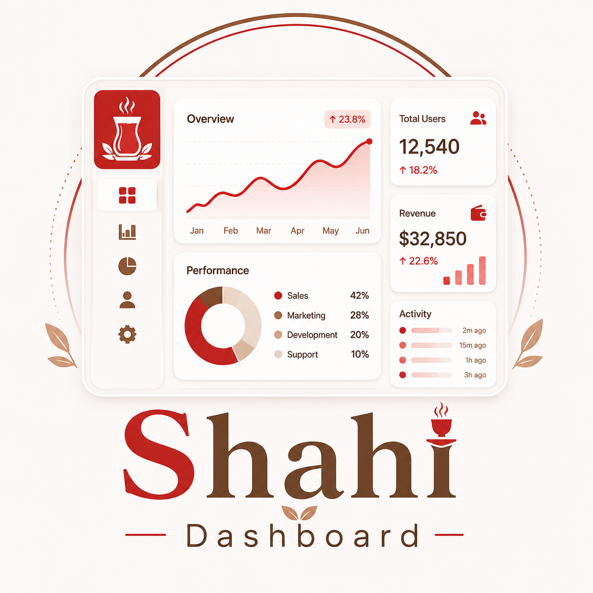

<div align="center">

   
# ☕ شاهي الجبل — لوحة الإدارة الداخلية

**Shahi Al-Jabal — Internal Management Dashboard**

لوحة تحكم داخلية احترافية لإدارة ومتابعة محل **شاهي الجبل** تشغيلياً وتحليلياً.
واجهة عربية بالكامل باتجاه **RTL**، مبنية بمعمارية جاهزة للربط مع أي نظام محاسبي.

[](https://nextjs.org/)
[](https://www.typescriptlang.org/)
[](https://tailwindcss.com/)
[](#-الرخصة)

</div>

---

## 📋 نظرة عامة

نظام لوحات تحكّم (Dashboards) يمنح إدارة المحل رؤية لحظية وتحليلية للأداء التشغيلي والمالي:
المبيعات، تكلفة المنتجات والربحية، المخزون والتنبيهات، المشتريات والموردين، المصروفات،
الهدر، أداء الموظفين، والتقارير — كل ذلك في واجهة واحدة متناسقة.

> المشروع مبني بنمط **مزوّد بيانات قابل للتبديل (Adapter Pattern)**: يعمل حالياً على بيانات
> تجريبية، وجاهز للربط مع نظام محاسبي حقيقي (مثل **دفترة Daftra**) دون تعديل الصفحات.

---

## ✨ المميزات

- 🎯 **لوحة تنفيذية لحظية** — مؤشرات الأداء (KPIs) ورسوم بيانية وتنبيهات المخزون في نظرة واحدة.
- 💰 **تحليل الربحية** — تكلفة كل منتج لكل كوب، الهامش، وتصنيف الربحية تلقائياً.
- 📦 **إدارة المخزون الذكية** — الأيام المتبقية لكل مادة وحالتها (ممتاز / منخفض / خطر) وتنبيهات إعادة الطلب.
- 🧾 **سجل المبيعات** — فواتير تفصيلية مع فلترة (يوم / أسبوع / شهر) وأعلى المنتجات.
- 🚚 **المشتريات والموردين** — متابعة الفواتير، المستحقات الآجلة، ومقارنة تغيّر الأسعار.
- 💸 **المصروفات والهدر** — تصنيف ثابت/متغيّر، رسوم توزيع، وتتبّع أسباب الفاقد.
- 👥 **أداء الموظفين** — مقارنة الفريق عبر الشفتات بمؤشرات أداء.
- 📊 **تقارير جاهزة** — ملخّصات تحليلية حسب الفترة الزمنية.
- 🌐 **عربي / RTL بالكامل** + تصميم متجاوب (Responsive) للجوال والحاسب.

---

## 🛠️ التقنيات

| الطبقة | التقنية |
|--------|---------|
| الإطار | **Next.js 14** (App Router) + **React 18** |
| اللغة | **TypeScript 5** (strict) |
| التنسيق | **Tailwind CSS 3** + مكوّنات بأسلوب shadcn (مبنية داخلياً) |
| الرسوم | **Recharts** |
| الأيقونات | **lucide-react** |
| الخطوط | Cairo / Tajawal |

---

## 🚀 التشغيل

> يتطلب **Node.js 18.18** أو أحدث.

```bash
# 1) تثبيت الحزم
npm install

# 2) بيئة التطوير
npm run dev          # http://localhost:3000

# 3) الإنتاج
npm run build
npm run start
```

---

## 🔌 الربط مع نظام محاسبي

الصفحات لا تعرف مصدر البيانات — تستورد دوال **async** من `lib/data` فقط (مثل `getInvoices()` و `getDashboard()`).
التبديل بين المصادر يتم عبر متغيّر بيئة واحد.

```bash
# انسخ القالب واضبط القيم
cp .env.example .env.local
```

```env
DATA_SOURCE=accounting                          # mock (افتراضي) أو accounting
ACCOUNTING_API_URL=https://<subdomain>.daftra.com
ACCOUNTING_API_KEY=<your-api-key>
```

**خطوات إكمال الربط:**
1. اضبط `DATA_SOURCE=accounting` وبيانات الـ API في `.env.local`.
2. أكمِل تحويل (mapping) الاستجابات في [`lib/data/accounting/provider.ts`](lib/data/accounting/provider.ts) —
   كل دالة تجلب عبر `apiGet(...)` ثم تُحوّل النتيجة إلى أنواع [`lib/types.ts`](lib/types.ts).
3. شغّل التطبيق — كل الصفحات والاشتقاقات تعمل دون أي تعديل.

> 🔒 مفتاح الـ API يبقى على الخادم فقط ولا يصل المتصفح أبداً.

---

## 🗂️ بنية المشروع

```
app/                    # الصفحات (App Router) — كلها async تجلب من طبقة البيانات
components/
  layout/               # Sidebar, Shell, إعداد التنقل
  ui/                   # KPICard, ChartCard, DataTable, StatusBadge, AlertCard, ...
  views/                # مكوّنات العرض التفاعلية (SalesView, ReportsView, SettingsView)
  charts.tsx            # مكوّنات الرسوم (Recharts)
lib/
  types.ts              # أنواع نطاق العمل (مصدر الحقيقة الوحيد للأنواع)
  config.ts             # اختيار مصدر البيانات + بيانات اعتماد الـ API
  utils.ts              # دوال التنسيق العربية (ر.س، النِسب) + cn
  data/
    index.ts            # الواجهة العامة (async) التي تستوردها الصفحات
    provider.ts         # عقد DataProvider الموحّد
    derive.ts           # كل الاشتقاقات النقية (مؤشرات، تنبيهات، إجماليات)
    mock/               # مزوّد البيانات التجريبية (seed + provider)
    accounting/         # مزوّد النظام المحاسبي (client + provider) — جاهز للربط
```

**فلسفة المعمارية:** المزوّد يُرجِع الكيانات الخام فقط، والاشتقاقات (المؤشرات، الأكثر مبيعاً،
تنبيهات المخزون، الإجماليات) مركزية في `derive.ts` وتعمل على JSON عادي — فتُستخدم نفسها مع أي مصدر.

---

## 📄 الصفحات

| المسار | الوصف |
|--------|-------|
| `/` | اللوحة التنفيذية (KPIs + رسوم + تنبيهات المخزون) |
| `/sales` | المبيعات والفواتير وأعلى المنتجات |
| `/products` | تكلفة المنتجات والربحية لكل كوب |
| `/recipes` | الوصفات وتكلفة كل وصفة |
| `/inventory` | المخزون والأيام المتبقية وحالة كل مادة |
| `/purchases` | المشتريات والموردين ومقارنة الأسعار |
| `/expenses` | المصروفات الثابتة والمتغيرة |
| `/waste` | الهدر والتالف وأسبابه |
| `/staff` | أداء الموظفين والشفتات |
| `/reports` | التقارير حسب الفترة الزمنية |
| `/settings` | بيانات المحل والمستخدمون والتنبيهات |

---

## 🧭 خارطة الطريق (Roadmap)

- [ ] المصادقة وحماية المسارات (Auth.js / Clerk) + صلاحيات حسب الدور (RBAC).
- [ ] حالات التحميل والأخطاء (`loading.tsx` / `error.tsx`) + skeletons.
- [ ] إكمال الربط الفعلي مع النظام المحاسبي.
- [ ] تفعيل تصدير التقارير (PDF / Excel).
- [ ] اختبارات (Vitest لدوال الاشتقاق + Playwright للتدفقات) و CI.
- [ ] نقل الخطوط إلى `next/font` (أداء وعمل دون إنترنت).

---

## 📝 ملاحظات

- جميع الأرقام والأسماء في الوضع التجريبي (`mock`) لأغراض العرض فقط.
- الخطوط (Cairo / Tajawal) تُحمّل حالياً من Google Fonts وقت التشغيل.

---

## 📜 الرخصة

هذا المشروع مرخّص تحت رخصة **MIT** — انظر ملف [`LICENSE`](LICENSE).

<div align="center">

صُنع بعناية لإدارة **شاهي الجبل** ☕

</div>
